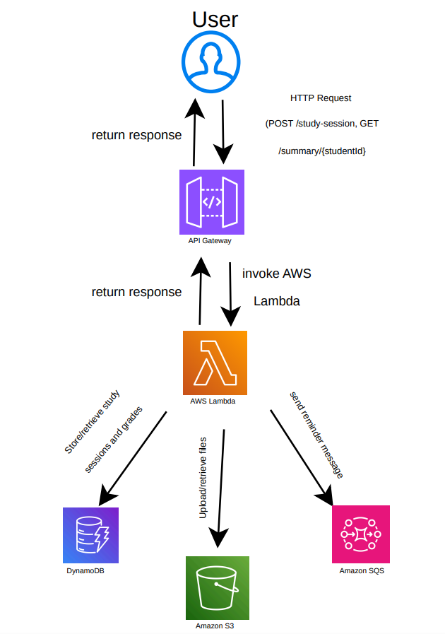

# academic-performance-tracker
Serverless academic performance tracking application built with Python and AWS.

## Overview

The Academic Performance Tracker was developed to demonstrate how multiple AWS services can work together to create a serverless application. The application allows academic information to be stored and managed through REST API endpoints while supporting automated application workflows.

## Technologies Used

- Python
- AWS Lambda
- Amazon API Gateway
- Amazon DynamoDB
- Amazon S3
- Amazon SQS
- Boto3
- REST APIs

## Features

- Store and manage academic performance data
- REST API endpoints for application functionality
- Serverless backend using AWS Lambda
- DynamoDB for cloud-based data storage
- S3 integration for application resources
- SQS integration for asynchronous workflows and automated reminders
- Python and Boto3 integration with AWS services

## Architecture

The application uses a serverless AWS architecture:

**User → API Gateway → AWS Lambda → DynamoDB / Amazon S3 / Amazon SQS**

## What I Learned

This project gave me hands-on experience building a serverless application and connecting multiple AWS services. I gained experience working with REST APIs, cloud databases, event-driven architecture, Python, and the AWS SDK for Python (Boto3).

## Author

**Anmol Sandhu**  
B.S. Information Technology — Cloud Computing  
George Mason University | May 2027
